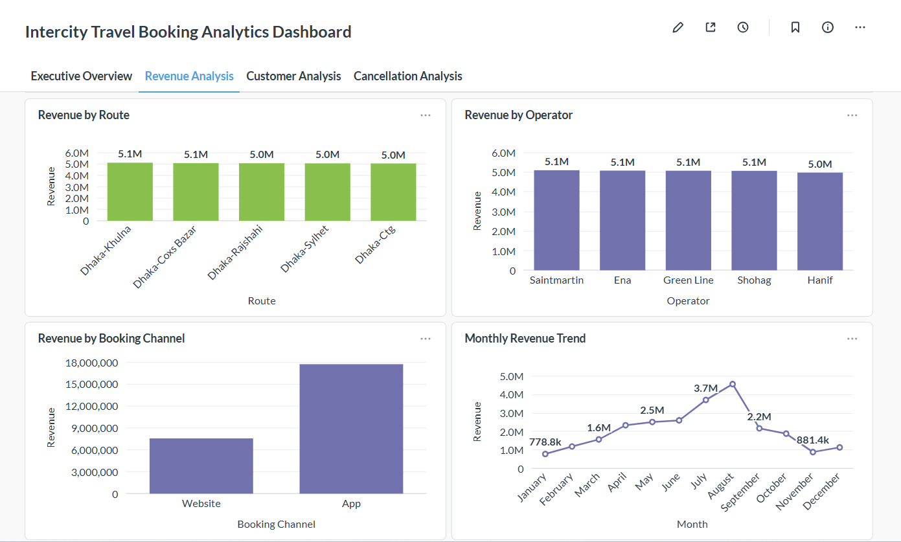
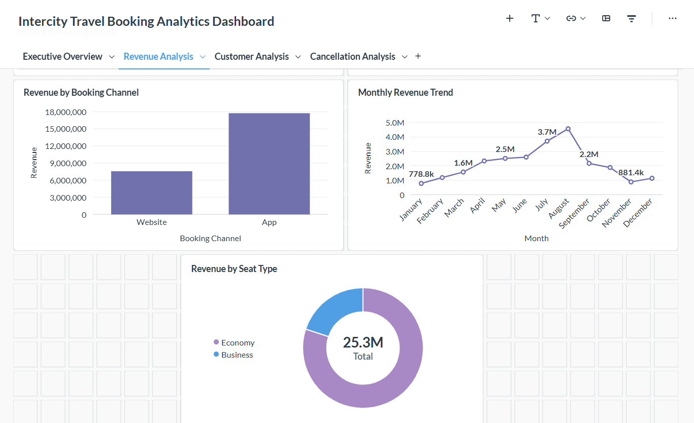
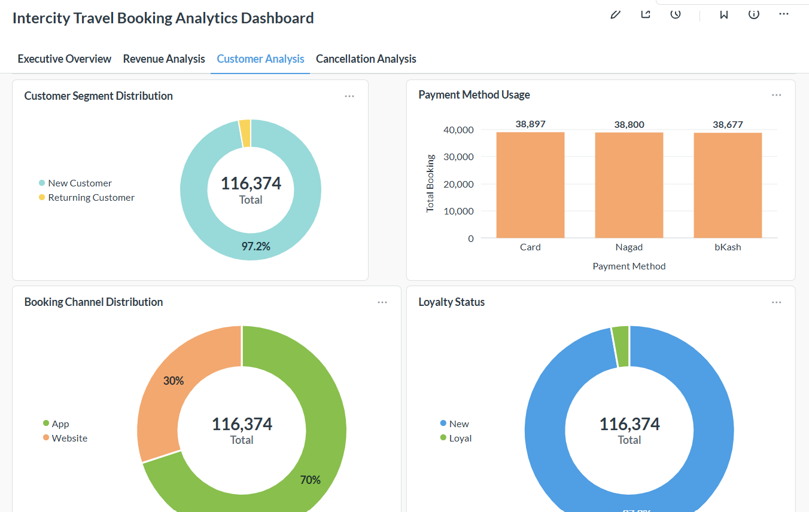
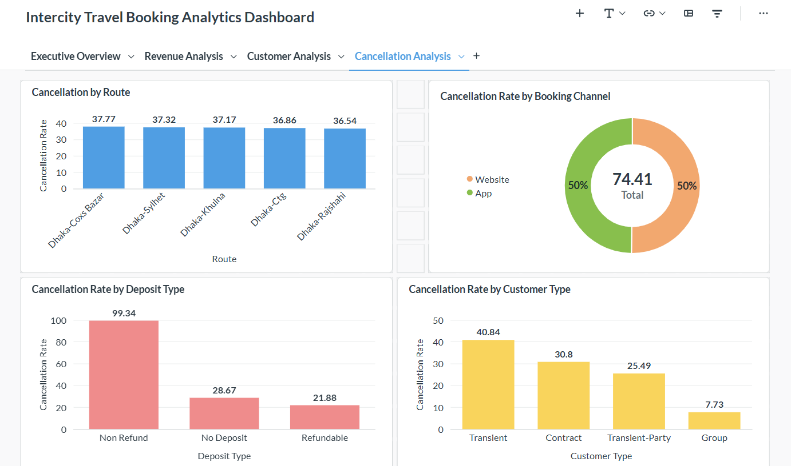
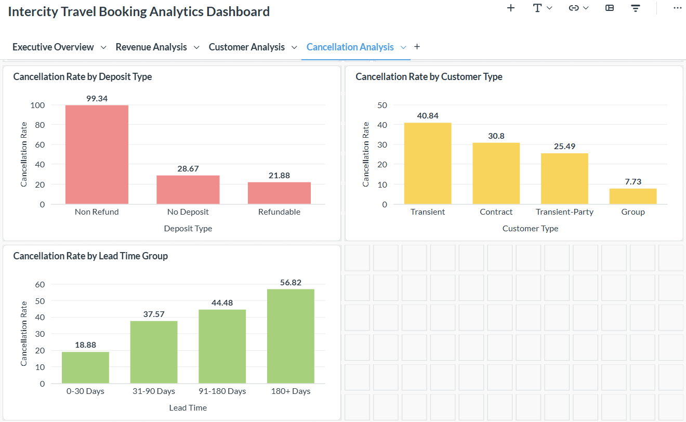

# Intercity-Travel-Booking-Analytics-Dashboard
Business Intelligence and data analytics project simulating an online intercity travel booking platform. Developed to extract actionable insights through data cleaning, feature engineering, SQL analysis, dashboarding, and KPI reporting.

## Project Overview

This project demonstrates a complete analytics workflow, including:

- Data preprocessing and feature engineering with Python
- Data storage and querying using MySQL
- Business analysis with SQL
- Interactive dashboard creation using Metabase
- Insight generation from booking and cancellation patterns

## Dataset

- Original Dataset: **Hotel Booking Demand Dataset**
- Domain Transformation: Hotel bookings → Intercity travel bookings
- Final Dataset Size: **116,374 records**

Additional engineered features include:

- Route
- Operator name
- Seat type
- Payment method
- Customer segment
- Loyalty status
- Revenue category
- Occupancy category
  
## Key Insights

- App bookings contribute the majority of total revenue.
- Economy seats generate most of the revenue.
- Revenue varies across operators and routes.
- Customer behavior differs by booking channel and payment method.
- Longer lead times are associated with higher cancellation rates.
  
## Tech Stack
- Python
- Pandas
- NumPy
- SQL
- MySQL
- Metabase
- Excel

# Dashboard Screenshots

## Executive Overview

---

## Revenue Analysis

---

## Customer Analysis

---

## Cancellation Analysis

---

## Author

**Ashfiqun Mustari**
